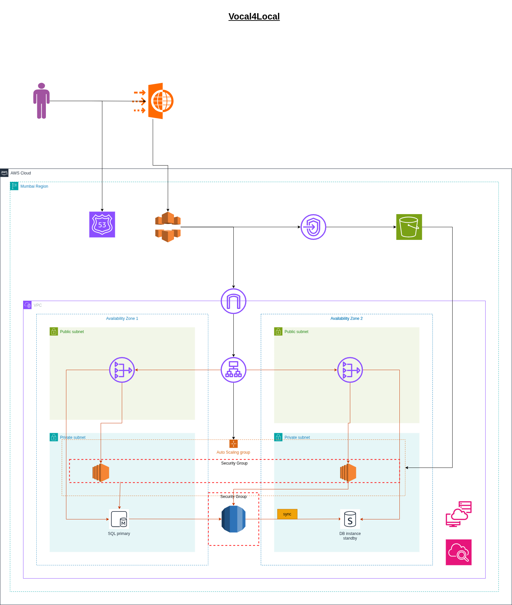

# AWS Scalable Web Architecture: Vocal4Local Migration

This project demonstrates the architectural design and migration strategy for **Vocal4Local**, an Indian artisan startup moving from a single on-premises server to a highly available, secure, and scalable AWS Cloud infrastructure.

## 1. The Challenge (Problem Statement)
The startup faced four critical "deal-breakers" that threatened their business:
* **Reliability:** A single server in Bhimavaram meant any power cut stopped all sales.
* **Latency:** Customers in North India and Europe experienced slow load times.
* **Security:** Their database was exposed to the public internet.
* **Scalability:** They couldn't handle traffic spikes during major holiday sales.

---

## 2. Architectural Design 

---

## 3. The Solution: Before vs. After
| Feature | Legacy Setup (On-Prem) | Modern Architecture (AWS) |
| :--- | :--- | :--- |
| **Availability** | Single Point of Failure | **Multi-AZ** (Redundant data centers) |
| **Security** | Publicly exposed Database | **Private Subnets** (Hidden from internet) |
| **Performance** | Local server bottleneck | **CloudFront** (Global Edge Caching) |
| **Scalability** | Manual hardware limits | **Auto Scaling** (Elastic growth) |
| **Database** | Manual, unpatched "Bullshit" DB | **Amazon RDS** (Managed & Self-healing) |

---

## 4. Architectural Design
The architecture follows the **AWS Well-Architected Framework** pillars of Security and Reliability.

### The 3-Tier Flow:
1.  **Edge Layer:** **Route 53** directs traffic to **CloudFront**, which serves static artisan images directly from **S3** to reduce latency.
2.  **Web/App Layer:** An **Application Load Balancer (ALB)** sits in the Public Subnet, acting as the gatekeeper. It distributes traffic to an **Auto Scaling Group** of EC2 instances in Private Subnets.
3.  **Data Layer:** A managed **Amazon RDS (Multi-AZ)** instance stores transaction data, with a synchronous standby copy in a different Availability Zone for instant failover.

---

## 5. Security Implementation
I applied the **Principle of Least Privilege** across the entire stack:
* **Network Isolation:** Only the ALB and NAT Gateway live in Public Subnets. All application and database logic is hidden in **Private Subnets**.
* **Security Groups:**
    * **ALB SG:** Allows HTTPS (443) from the world.
    * **EC2 SG:** Allows traffic **only** from the ALB Security Group.
    * **RDS SG:** Allows traffic **only** from the EC2 Security Group.
* **WAF:** Protects against SQL injection and common web exploits at the edge.

---

## 6. Thinking Process & Key Decisions
* **Why S3 over EBS?** High-resolution product images shouldn't be trapped on one server. S3 allows all servers to access images simultaneously and offers 99.999999999% durability.
* **Why RDS instead of EC2-DB?** To eliminate "undifferentiated heavy lifting." AWS handles backups and patching so the startup can focus on selling crafts, not managing Linux updates.
* **Why Multi-AZ?** Because "everything fails all the time." Designing for failure ensures the business survives a data center outage.

---

## 7. How to Deploy (Manual Proof-of-Concept)
> **Note:** This project is currently in the **Design & Prototype** phase.
1.  **Networking:** Create a VPC with 2 Public and 2 Private Subnets across two AZs.
2.  **Storage:** Create an S3 bucket with "Block Public Access" enabled (Use CloudFront OAC).
3.  **Database:** Launch an RDS MySQL instance in the Private Subnets with the "Multi-AZ" option checked.
4.  **Compute:** Launch an EC2 instance, configure the Web Server, and create an Amazon Machine Image (AMI).
5.  **Scaling:** Set up an ALB and an Auto Scaling Group using the AMI created in the previous step.

---

## 8. Roadmap
* [x] Problem Analysis & Requirement Gathering
* [x] Initial Architecture Design
* [x] Security Group Policy Definition
* [ ] **Next Step:** Convert this manual "ClickOps" design into **Terraform (Infrastructure as Code)** for 1-click deployment.

---

